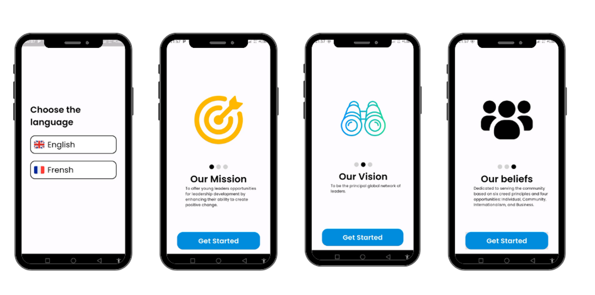
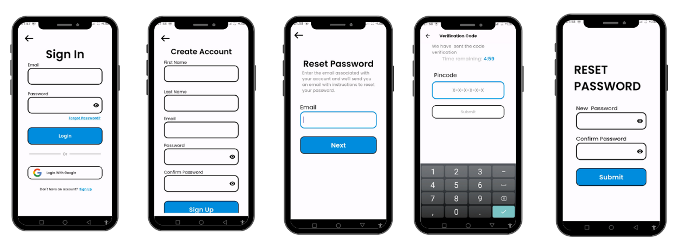
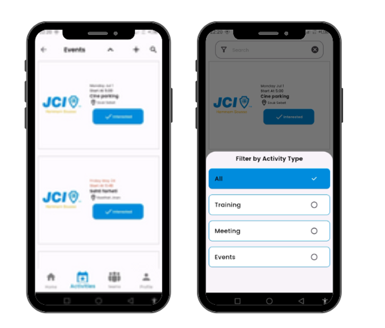

# Overview

This project aims to get more people involved in the community, make events more popular, and make it easier for people to communicate with each other. By using different strategies like good promotion, easy-to-use designs, and reminders, this project wants to create a friendly and helpful community.
## Features
### Smooth Interaction and Cooperation
 Implemented strategies to facilitate seamless interaction and cooperation among community members, fostering a supportive environment for collaboration and growth.

### Boosted Event Attendance:
 Achieved a significant increase of 10% in event attendance through targeted promotion efforts and coordinated scheduling of trainings, meetings, and events.


### Interactive Reminders and Motivational Messages

Scheduled interactive reminders and motivational messages to keep community members informed and engaged, encouraging active participation and contribution.


## Installation


 clone The repo
```bash
  git clone https://github.com/luckyman147/jci_app.git
  cd backend
```

You need to initialize flutter packages
```bash
cd jci_app
flutter pub get 
```

!! you need to ensure that you have mongodb compass installed 

To Run the server
```bash
  cd server 
  nodemon 
```


## Technologie used

### Front-end: Flutter 
Used for building the mobile application, providing a seamless user experience across both iOS and Android devices.
#### Back-end: Express.js
Used for building the server-side application, handling API requests, user authentication, and data encryption.


## Documentation

### Clean architecture 
I have implemented the clean architecture in my project ,this divide interests  into 3 layers, the first layer is the presentation layer which include Use interfaces components and bloc consumers for responsive ui , the domain layer is the most important layer which includes use cases which are the application specific business logic and the entities which are the core busness objects, the final layer is data layer , ir encludes the repositories and models to connect to uses cases to datasources

### Bloc 

Core components: 

•	Bloc (Business Logic Component): The heart of the architecture, it encapsulates the business logic of your application. This class acts as an intermediary between user interactions (events) and state updates within the UI. It does not interact directly with the UI itself.

•	Events: Represent actions or signals that can trigger changes in the state of the ap-plication. They are typically Dart objects or Enums that capture user actions or ex-ternal triggers.

•	States: Represent the current data or state of your application's UI. They are Dart objects that reflect the data your UI must display in response to events. 

## Screenshots


When you open the app for the first time, you can choose the language. Then you'll see the JCI principles: the mission, vision, and beliefs. 

To use the app, you need to log in. If you don't have an account, you can create one. If you forget your password, you can verify your email and PIN. Once verified, you can enter a new password.
If you keep forgetting your password I advice to login with google


As mentioned on the home page,  new members have the option to view the activities of the month. To attend an activity, simply click the "Join" button. new Members can also view the leader board, which displays the names of those who are working hard. new Members also could discover activities of the year by click the calendar button

This page includes the top three activities you can search for a specific event by name or location. You can also filter by type of activity. The administrator can create an activity and select the type of activity. 


